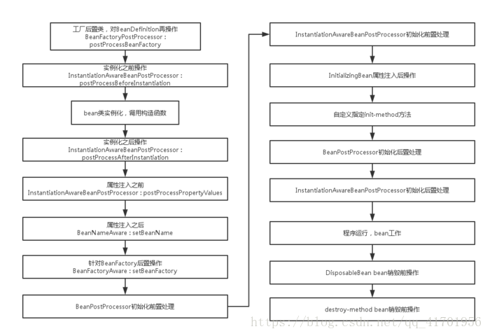
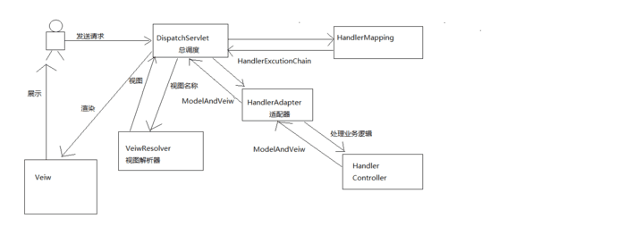
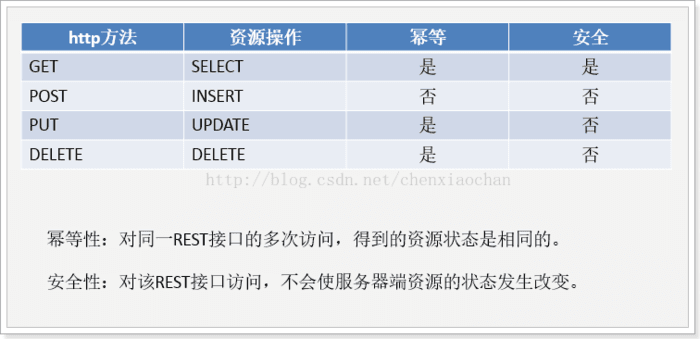

[2018年最新Java面试题及答案整理 - Java笔记 - CSDN博客](https://blog.csdn.net/qq_41701956/article/details/80250226)

微信公众号：Java团长

# NetEase Advance JAVA Dev

[](images/advanced-java-dev.png)

# 基础篇

## 封装，继承，多态和抽象

**封装**
​             封装给对象提供了隐藏内部特性和行为的能力。对象提供一些能被其他对象访问的方法来改
它内部的数据。在 Java 当中，有 3 种修饰符： public， private 和       protected。每一种修饰符
其他的位于同一个包或者不同包下面对象赋予了不同的访问权限。

通过隐藏对象的属性来保护对象内部的状态。提高了代码的可用性和可维护性，因为对象的行为可以被单独的改变或者是扩展。禁止对象之间的不良交互提高模块化

**继承**
​        继承给对象提供了从基类获取字段和方法的能力。继承提供了代码的重用行，也可以在不修改类的情况下给现存的类添加新特性。

**多态**
多态是编程语言给不同的底层数据类型做相同的接口展示的一种能力。一个多态类型上的操作可以应用到其他类型的值上面。

**抽象**
抽象是把想法从具体的实例中分离出来的步骤，因此，要根据他们的功能而不是实现细节来创建类。       Java 支持创建只暴漏接口而不包含方法实现的抽象的类。这种抽象技术的主要目的是把类的行为和实现细节分离开。

## final, finally, finalize 的区别

**final**
修饰符（关键字）如果一个类被声明为final，意味着它不能再派生出新的子类，不能作为父类被继承。因此一个类不能既被声明为       abstract的，又被声明为final的。将变量或方法声明为final，可以保证它们在使用中不被改变。被声明为final的变量必须在声明时给定初值，而在以后的引用中只能读取，不可修改。被声明为final的方法也同样只能使用，不能重载。
**finally**
在异常处理时提供 finally 块来执行任何清除操作。如果抛出一个异常，那么相匹配的 catch 子句就会执行，然后控制就会进入       finally 块（如果有的话）。
**finalize**
方法名。Java 技术允许使用 finalize()       方法在垃圾收集器将对象从内存中清除出去之前做必要的清理工作。这个方法是由垃圾收集器在确定这个对象没有被引用时对这个对象调用的。它是在 Object       类中定义的，因此所有的类都继承了它。子类覆盖 finalize() 方法以整理系统资源或者执行其他清理工作。finalize()       方法是在垃圾收集器删除对象之前对这个对象调用的。

## int 和 Integer 有什么区别

int 是基本数据类型
Integer是其包装类，注意是一个类。

为什么要提供包装类呢？？？
一是为了在各种类型间转化，通过各种方法的调用。否则 你无法直接通过变量转化。
比如，现在int要转为String

String result=Integer.toString(a);

在java中包装类，比较多的用途是用在于各种数据类型的转化中。

我写几个demo

```java
int num=Integer.valueOf("12");
int       num2=Integer.parseInt("12");
double       num3=Double.valueOf("12.2");
double       num4=Double.parseDouble("12.2");
String       a=String.valueOf("1234");
String       b=String.valueOf(true);
tring       c=new Integer(12).toString();
String       d=new Double(2.3).toString();
```

再举例下。比如我现在要用泛型

这里`<>`需要类。如果你用int。它会报错的。

## 重载和重写的区别

**override**

1. 方法名、参数、返回值相同。
2. 子类方法不能缩小父类方法的访问权限。
3. 子类方法不能抛出比父类方法更多的异常(但子类方法可以不抛出异常)。
4. 存在于父类和子类之间。
5. 方法被定义为final不能被重写。

**overload**

1. 参数类型、个数、顺序至少有一个不相同。
2. 不能重载只有返回值不同的方法名。
3. 存在于父类和子类、同类中。


## 抽象类和接口有什么区别

接口是公开的，里面不能有私有的方法或变量，是用于让别人使用的，而抽象类是可以有私有方法或私有变量的，
另外，实现接口的一定要实现接口里定义的所有方法，(JAVA 8: Interface default method)而实现抽象类可以有选择地重写需要用到的方法，一般的应用里，最顶级的是接口，然后是抽象类实现接口，最后才到具体类实现。
还有，接口可以实现多重继承，而一个类只能继承一个超类，但可以通过继承多个接口实现多重继承，接口还有标识（里面没有任何方法，如Remote接口）和数据共享（里面的变量全是常量）的作用。

## 反射的用途及实现

Java反射机制主要提供了以下功能：

1. 在运行时构造一个类的对象；
2. 判断一个类所具有的成员变量和方法；
3. 调用一个对象的方法；生成动态代理。

**反射最大的应用就是框架**

Java反射的主要功能：

- 确定一个对象的类
    - 取出类的modifiers,数据成员,方法,构造器,和超类.
    - 找出某个接口里定义的常量和方法说明.
    - 创建一个类实例,这个实例在运行时刻才有名字(运行时间才生成的对象).
    - 取得和设定对象数据成员的值,如果数据成员名是运行时刻确定的也能做到.
    - 在运行时刻调用动态对象的方法.
    - 创建数组,数组大小和类型在运行时刻才确定,也能更改数组成员的值.

反射的应用很多，很多框架都有用到

> spring 的 ioc/di 也是反射….
> javaBean和jsp之间调用也是反射….
> struts的 FormBean 和页面之间…也是通过反射调用….
> JDBC 的 classForName()也是反射…..
> hibernate的 find(Class clazz) 也是反射….

反射还有一个不得不说的问题，就是性能问题，**大量使用反射系统性能大打折扣** 怎么使用使你的系统达到最优就看你系统架构和综合使用问题啦，这里就不多说了。

来源：[http://uule.iteye.com/blog/1423512](https://link.jianshu.com/?t=http%3A%2F%2Fuule.iteye.com%2Fblog%2F1423512)

## 自定义注解的场景及实现

登陆、权限拦截、日志处理，以及各种Java框架，如Spring，Hibernate，JUnit 提到注解就不能不说反射，Java自定义注解是通过运行时靠反射获取注解。实际开发中，例如我们要**获取某个方法的调用日志**，可以通过AOP（动态代理机制）给方法添加切面，通过反射来获取方法包含的注解，如果包含日志注解，就进行日志记录。

## HTTP 请求的 GET 与 POST 方式的区别

GET方法会把名值对追加在请求的URL后面。因为URL对**字符数目有限制**，进而限制了用在客户端请求的参数值的数目。并且请求中的**参数值是可见**的，因此，敏感信息不能用这种方式传递。

POST方法通过把请求参数值放在请求体中来克服GET方法的限制，因此，可以发送的参数的数目是没有限制的。最后，通过POST请求传递的敏感信息对外部客户端是不可见的。

参考：[https://www.cnblogs.com/wangli-66/p/5453507.html](https://link.jianshu.com/?t=https%3A%2F%2Fwww.cnblogs.com%2Fwangli-66%2Fp%2F5453507.html)

## 请求转发和重定向

| Forward                      | Redirect                    |
| ---------------------------- | --------------------------- |
| 地址栏没有变化               | 地址栏变化                  |
| fast                         | slow                        |
| web -> server ->server ->web | web ->server > web > server |
| same request                 | different                   |

```java
request.getRequestDispatcher("demo.jsp").forward(request, response);

response.sendRedirect("demo.jsp");
```

## session 与 cookie 区别

cookie 是 Web 服务器发送给浏览器的一块信息。浏览器会在**本地文件中给每一个 Web 服务器存储 cookie**。
以后浏览器在给特定的  Web 服务器发请求的时候，同时会发送所有为该服务器存储的 cookie。

下面列出了 session 和 cookie 的区别：

无论客户端浏览器做怎么样的设置，session都应该能正常工作。客户端可以选择禁用 cookie，
但是， session 仍然是能够工作的，因为客户端无法禁用**服务端的 session**。

## JDBC 流程

1. 加载JDBC驱动程序：

在连接数据库之前，首先要加载想要连接的数据库的驱动到JVM（Java虚拟机），
这通过java.lang.Class类的静态方法forName(String  className)实现。

例如：

```java
try {
	Class.forName("com.mysql.jdbc.Driver")       ;
}catch(ClassNotFoundException e){
System.out.println("找不到驱动程序类 ，加载驱动失败！");
}
```
成功加载后，会将Driver类的实例注册到DriverManager类中。

2. 提供JDBC连接的URL

>连接URL定义了连接数据库时的协议、子协议、数据源标识。
>书写形式：协议：子协议：数据源标识

协议：在JDBC中总是以jdbc开始 子协议：是桥连接的驱动程序或是数据库管理系统名称。

数据源标识：标记找到数据库来源的地址与连接端口。

例如：

```java
public static String URL = "jdbc:mysql://localhost:3306/test?useUnicode=true&characterEncoding=gbk;useUnicode=true";
```
表示使用Unicode字符集。如果characterEncoding设置为gb2312或GBK，本参数必须设置为true 。characterEncoding=gbk：字符编码方式。

3. 创建数据库的连接

要连接数据库，需要向java.sql.DriverManager请求并获得Connection对象， 该对象就代表一个数据库的连接。
使用DriverManager.getConnectin(String url, String username, String password)方法传入指定的欲连接的数据库的路径、数据库的用户名和 密码来获得。

例如： //连接MySql数据库，用户名和密码都是root

```java
String url =       "jdbc:mysql://localhost:3306/test" ;
String       username = "root" ;
String       password = "root" ;
Connection       con = DriverManager.getConnection(url , username , password ) ;
System.out.println("数据库连接失败！");
```

4. 创建一个Statement

要执行SQL语句，必须获得java.sql.Statement实例，Statement实例分为以下3 种类型：

- 执行静态SQL语句。通常通过Statement实例实现。
- 执行动态SQL语句。通常通过PreparedStatement实例实现。
- 执行数据库存储过程。通常通过CallableStatement实例实现。

具体的实现方式：

```java
Statement stmt = con.createStatement();
PreparedStatement pstmt = con.prepareStatement(sql);
CallableStatement cstmt = con.prepareCall(“{CALL  demoSp(? , ?)}”);
```

5. 执行SQL语句

Statement接口提供了三种执行SQL语句的方法：executeQuery 、executeUpdate 和execute

- ResultSet executeQuery(String sqlString)：执行查询数据库的SQL语句 ，返回一个结果集（ResultSet）对象。
- int executeUpdate(String sqlString)：用于执行INSERT、UPDATE或 DELETE语句以及SQL  DDL语句，如：CREATE TABLE和DROP TABLE等
- execute(sqlString):用于执行返回多个结果集、多个更新计数或二者组合的 语句。 具体实现的代码：

```java
ResultSet rs = stmt.executeQuery(“SELECT * FROM …”);
int rows = stmt.executeUpdate(“INSERT INTO …”);
boolean flag =  stmt.execute(String sql) ;
```

6. 处理结果

两种情况：

- 执行更新返回的是本次操作影响到的记录数。
- 执行查询返回的结果是一个ResultSet对象。

ResultSet包含符合SQL语句中条件的所有行，并且它通过一套get方法提供了对这些 行中数据的访问。

使用结果集（ResultSet）对象的访问方法获取数据：

```java
while(rs.next()){
String name = rs.getString(“name”) ;
String pass = rs.getString(1) ; // 此方法比较高效
}
```

**列是从左到右编号的，并且从列1开始**

7. 关闭JDBC对象

操作完成以后要把所有使用的JDBC对象全都关闭，以释放JDBC资源，关闭顺序和声  明顺序相反：

- 关闭记录集
- 关闭声明
- 关闭连接对象

## MVC 设计思想

MVC就是
M:Model 模型
V:View 视图
C:Controller 控制器

模型就是封装业务逻辑和数据的一个一个的模块,控制器就是调用这些模块的(java中通常是用Servlet来实现,框架的话很多是用Struts2来实现这一层),视图就主要是你看到的,比如JSP等.
当用户发出请求的时候,控制器根据请求来选择要处理的业务逻辑和要选择的数据,再返回去把结果输出到视图层,这里可能是进行重定向或转发等.

## equals 与 == 的区别

值类型（int,char,long,boolean等）都是用==判断相等性。对象引用的话，==判断引用所指的对象是否是同一个。equals是Object的成员函数，有些类会覆盖（override）这个方法，用于判断对象的等价性。例如String类，两个引用所指向的String都是”abc”，但可能出现他们实际对应的对象并不是同一个（和jvm实现方式有关），因此用==判断他们可能不相等，但用equals判断一定是相等的。

## 集合

**List 和 Set 区别**

List,Set都是继承自Collection接口

List特点：元素有放入顺序，元素可重复
Set特点：元素无放入顺序，元素不可重复，重复元素会覆盖掉
（注意：元素虽然无放入顺序，但是元素在set中的位置是有该元素的HashCode决定的，其位置其实是固定的，加入Set 的Object必须定义equals()方法 ，另外list支持for循环，也就是通过下标来遍历，也可以用迭代器，但是set只能用迭代，因为他无序，无法用下标来取得想要的值。）

Set和List对比：

Set：检索元素效率低下，删除和插入效率高，插入和删除不会引起元素位置改变。
List：和数组类似，List可以动态增长，查找元素效率高，插入删除元素效率低，因为会引起其他元素位置改变。

**List 和 Map 区别**

List是对象集合，允许对象重复。
Map是键值对的集合，不允许key重复。

**Arraylist 与 LinkedList 区别**

Arraylist：
优点：ArrayList是实现了基于动态数组的数据结构,因为地址连续，一旦数据存储好了，查询操作效率会比较高（在内存里是连着放的）。
缺点：因为地址连续， ArrayList要移动数据,所以插入和删除操作效率比较低。

LinkedList：
优点：LinkedList基于链表的数据结构,地址是任意的，所以在开辟内存空间的时候不需要等一个连续的地址，对于新增和删除操作add和remove，LinedList比较占优势。LinkedList 适用于要头尾操作或插入指定位置的场景
缺点：因为LinkedList要移动指针,所以查询操作性能比较低。

适用场景分析：
当需要对数据进行对此访问的情况下选用ArrayList，当需要对数据进行多次增加删除修改时采用LinkedList。

**ArrayList 与 Vector 区别**

>public ArrayList(int initialCapacity)
>public ArrayList(Collection<? extends E> c)

Vector有四个构造方法：

>public Vector(int initialCapacity)
>public Vector(Collection<? extends E> c)
>public Vector(int initialCapacity,int capacityIncrement)

ArrayList和Vector都是用数组实现的，主要有这么三个区别：

1. Vector是多线程安全的，线程安全就是说多线程访问同一代码，不会产生不确定的结果。而ArrayList不是，这个可以从源码中看出，Vector类中的方法很多有synchronized进行修饰，这样就导致了Vector在效率上无法与ArrayList相比；
2. 两个都是采用的线性连续空间存储元素，但是当空间不足的时候，两个类的增加方式是不同。
3. Vector可以设置增长因子，而ArrayList不可以。
4. Vector是一种老的动态数组，是线程同步的，效率很低，一般不赞成使用。

适用场景分析：

1. Vector是线程同步的，所以它也是线程安全的，而ArrayList是线程异步的，是不安全的。如果不考虑到线程的安全因素，一般用ArrayList效率比较高。
2. 如果集合中的元素的数目大于目前集合数组的长度时，在集合中使用数据量比较大的数据，用Vector有一定的优势。

**HashMap 和 Hashtable 的区别**

1. hashMap去掉了HashTable 的contains方法，但是加上了containsValue（）和containsKey（）方法。
2. hashTable同步的，而HashMap是非同步的，效率上逼hashTable要高。
3. hashMap允许空键值，而hashTable不允许。

注意：
TreeMap：非线程安全基于红黑树实现。TreeMap没有调优选项，因为该树总处于平衡状态。
Treemap：适用于按自然顺序或自定义顺序遍历键(key)。

参考：[http://blog.csdn.net/qq_22118507/article/details/51576319](https://link.jianshu.com/?t=http%3A%2F%2Fblog.csdn.net%2Fqq_22118507%2Farticle%2Fdetails%2F51576319)

**HashSet 和 HashMap 区别**

set是线性结构，set中的值不能重复，hashset是set的hash实现，hashset中值不能重复是用hashmap的key来实现的。
map是键值对映射，可以空键空值。HashMap是Map接口的hash实现，key的唯一性是通过key值hash值的唯一来确定，value值是则是链表结构。
他们的共同点都是hash算法实现的唯一性，他们都不能持有基本类型，只能持有对象

**HashMap 和 ConcurrentHashMap 的区别**

ConcurrentHashMap是线程安全的HashMap的实现。

- ConcurrentHashMap对整个桶数组进行了分割分段(Segment)，然后在每一个分段上都用lock锁进行保护，相对于HashTable的syn关键字锁的粒度更精细了一些，并发性能更好，而HashMap没有锁机制，不是线程安全的。

- HashMap的键值对允许有null，但是ConCurrentHashMap都不允许。

HashMap 的工作原理及代码实现

参考：[https://tracylihui.github.io/2015/07/01/Java](https://link.jianshu.com/?t=https%3A%2F%2Ftracylihui.github.io%2F2015%2F07%2F01%2FJava)集合学习1：HashMap的实现原理/

ConcurrentHashMap 的工作原理及代码实现

HashTable里使用的是synchronized关键字，这其实是对对象加锁，锁住的都是对象整体，当Hashtable的大小增加到一定的时候，性能会急剧下降，因为迭代时需要被锁定很长的时间。
ConcurrentHashMap算是对上述问题的优化，其构造函数如下，默认传入的是16，0.75，16。

```java
public ConcurrentHashMap(int paramInt1, float paramFloat, intparamInt2) {

        this.segmentShift = (32 - i);
        this.segmentMask = (j - 1);
        this.segments = Segment.newArray(j);

        for (int i1 = 0; i1 < this.segments.length; ++i1)
            this.segments[i1] = new Segment(l, paramFloat);

        public V put(K paramK, V paramV) {
                throw new NullPointerException();
                int i = hash(paramK.hashCode());
                return this.segments[(i >>> this.segmentShift & this.segmentMask)].put(paramK, i, paramV, false);
            }
}
```

ConcurrentHashMap引入了分割(Segment)，上面代码中的最后一行其实就可以理解为把一个大的Map拆分成N个小的HashTable，在put方法中，会根据hash(paramK.hashCode())来决定具体存放进哪个Segment，如果查看Segment的put操作，我们会发现内部使用的同步机制是基于lock操作的，这样就可以对Map的一部分（Segment）进行上锁，这样影响的只是将要放入同一个Segment的元素的put操作，保证同步的时候，锁住的不是整个Map（HashTable就是这么做的），相对于HashTable提高了多线程环境下的性能，因此HashTable已经被淘汰了。

## 线程

### 创建线程的方式及实现

Java中创建线程主要有三种方式：

**继承Thread类创建线程类**

```java
public class FirstThreadTest extends Thread {

    System.out.println(getName());

    public static void main(String[] args){
    	    for (int i = 0; i < 100; i++)
		        System.out.println(Thread.currentThread().getName() + " : " + i);

		    new FirstThreadTest().start();
		    new FirstThreadTest().start();

    }
}
```

上述代码中Thread.currentThread()方法返回当前正在执行的线程对象。getName()方法返回调用该方法的线程的名字。

**通过Runnable接口创建线程类***

```java
public class RunnableThreadTest implements Runnable {
    System.out.println(Thread.currentThread().getName());

    public static void main(String[] args) {
        for (int i = 0; i < 100; i++)
            System.out.println(Thread.currentThread().getName() + " " + i);

        RunnableThreadTest rtt = new RunnableThreadTest();

        new Thread(rtt, "新线程1").start();
        new Thread(rtt, "新线程2").start();
    }
}
```

#### **通过Callable和Future创建线程** `java.util.concurrent`

1. 创建Callable接口的实现类，并实现call()方法，该call()方法将作为线程执行体，并且有返回值。
2. 创建Callable实现类的实例，使用FutureTask类来包装Callable对象，该FutureTask对象封装了该Callable对象的call()方法的返回值。
3. 使用FutureTask对象作为Thread对象的target创建并启动新线程。
4. 调用FutureTask对象的get()方法来获得子线程执行结束后的返回值

```java
public class CallableThreadTest implements Callable<Integer> {
    public static void main(String[] args)  
    {  
        CallableThreadTest ctt = new CallableThreadTest();  
        FutureTask<Integer> ft = new FutureTask<>(ctt);  
        for(int i = 0;i < 100;i++)  
        {  
            System.out.println(Thread.currentThread().getName()+" 的循环变量i的值"+i);  
            if(i==20)  
            {  
                new Thread(ft,"有返回值的线程").start();  
            }  
        }  
        try  
        {  
            System.out.println("子线程的返回值："+ft.get());  
        } catch (InterruptedException e)  
        {  
            e.printStackTrace();  
        } catch (ExecutionException e)  
        {  
            e.printStackTrace();  
        }  
  
    }
    @Override  
    public Integer call() throws Exception  
    {  
        int i = 0;  
        for(;i<100;i++)  
        {  
            System.out.println(Thread.currentThread().getName()+" "+i);  
        }  
        return i;  
    }  
}
```

**创建线程的三种方式的对比**

采用实现Runnable、Callable接口的方式创见多线程时
优势是：
线程类只是实现了Runnable接口或Callable接口，还可以继承其他类。
在这种方式下，多个线程可以共享同一个target对象，所以非常适合多个相同线程来处理同一份资源的情况，从而可以将CPU、代码和数据分开，形成清晰的模型，较好地体现了面向对象的思想。

劣势是：
编程稍微复杂，如果要访问当前线程，则必须使用Thread.currentThread()方法。


### sleep() 、join（）、yield（）有什么区别

**sleep()方法**

在指定的毫秒数内让当前正在执行的线程休眠（暂停执行），此操作受到系统计时器和调度程序精度和准确性的影响。 让其他线程有机会继续执行，但它并**不释放对象锁**。也就是如果有Synchronized同步块，其他线程仍然不能访问共享数据。注意该方法要捕获异常

比如有两个线程同时执行(没有Synchronized)，一个线程优先级为MAX_PRIORITY，另一个为MIN_PRIORITY，如果没有Sleep()方法，只有高优先级的线程执行完成后，低优先级的线程才能执行；但当高优先级的线程sleep(5000)后，低优先级就有机会执行了。

总之，sleep()可以使低优先级的线程得到执行的机会，当然也可以让同优先级、高优先级的线程有执行的机会。

**yield()方法**

yield()方法和sleep()方法类似，也不会释放“锁标志”，区别在于，它没有参数，即yield()方法只是使当前线程重新回到可执行状态，所以执行yield()的线程有可能在进入到可执行状态后马上又被执行，另外yield()方法只能使同优先级或者高优先级的线程得到执行机会，这也和sleep()方法不同。

**join()方法**

Thread的非静态方法join()让一个线程B“加入”到另外一个线程A的尾部。在A执行完毕之前，B不能工作。

```java
Thread  t = new MyThread();
t.start();
t.join();
```
保证当前线程停止执行，直到该线程所加入的线程完成为止。然而，如果它加入的线程没有存活，则当前线程不需要停止。

### CountDownLatch 原理

参考：

[分析CountDownLatch的实现原理](https://www.jianshu.com/p/7c7a5df5bda6?ref=myread)

[什么时候使用CountDownLatch](https://link.jianshu.com/?t=http%3A%2F%2Fwww.importnew.com%2F15731.html)

[Java并发编程：CountDownLatch、CyclicBarrier和Semaphore](https://link.jianshu.com/?t=http%3A%2F%2Fwww.cnblogs.com%2Fdolphin0520%2Fp%2F3920397.html)

### 说说 CyclicBarrier 原理

参考：

[JUC回顾之-CyclicBarrier底层实现和原理](https://link.jianshu.com/?t=http%3A%2F%2Fwww.cnblogs.com%2F200911%2Fp%2F6060195.html)

### 说说 Semaphore 原理

[JAVA多线程–信号量(Semaphore)](https://link.jianshu.com/?t=https%3A%2F%2Fmy.oschina.net%2Fcloudcoder%2Fblog%2F362974)

[JUC回顾之-Semaphore底层实现和原理](https://link.jianshu.com/?t=https%3A%2F%2Fwww.cnblogs.com%2F200911%2Fp%2F6060359.html)

### 说说 Exchanger 原理

[java.util.concurrent.Exchanger应用范例与原理浅析](https://link.jianshu.com/?t=http%3A%2F%2Flixuanbin.iteye.com%2Fblog%2F2166772)

### 说说 CountDownLatch 与  CyclicBarrier 区别


[尽量把CyclicBarrier和CountDownLatch的区别说通俗点](https://link.jianshu.com/?t=http%3A%2F%2Faaron-han.iteye.com%2Fblog%2F1591755)

### ThreadLocal 原理分析

[Java并发编程：深入剖析ThreadLocal](https://link.jianshu.com/?t=https%3A%2F%2Fwww.cnblogs.com%2Fdolphin0520%2Fp%2F3920407.html)

### 讲讲线程池的实现原理

主要是ThreadPoolExecutor的实现原理

[Java并发编程：线程池的使用](https://link.jianshu.com/?t=http%3A%2F%2Fwww.cnblogs.com%2Fdolphin0520%2Fp%2F3932921.html)

#### 线程池的几种方式

newFixedThreadPool(int nThreads)

创建一个固定长度的线程池，每当提交一个任务就创建一个线程，直到达到线程池的最大数量，这时线程规模将不再变化，当线程发生未预期的错误而结束时，线程池会补充一个新的线程

newCachedThreadPool()

创建一个可缓存的线程池，如果线程池的规模超过了处理需求，将自动回收空闲线程，而当需求增加时，则可以自动添加新线程，线程池的规模不存在任何限制

newSingleThreadExecutor()

这是一个单线程的Executor，它创建单个工作线程来执行任务，如果这个线程异常结束，会创建一个新的来替代它；它的特点是能确保依照任务在队列中的顺序来串行执行

newScheduledThreadPool(int corePoolSize)

创建了一个固定长度的线程池，而且以延迟或定时的方式来执行任务，类似于Timer。

举个栗子


1. private static final Executor       exec=Executors.newFixedThreadPool(50);
2. Runnable       runnable=new Runnable(){
3. Callable<Object>       callable=new Callable<Object>() {
4. public       Object call() throws Exception {
5. Future       future=executorService.submit(callable);

参考：

[创建线程池的几种方式](https://link.jianshu.com/?t=http%3A%2F%2Fblog.csdn.net%2Fcyantide%2Farticle%2Fdetails%2F50880211)

### 线程的生命周期

新建(New)、就绪（Runnable）、运行（Running）、阻塞(Blocked)和死亡(Dead)5种状态

(1)生命周期的五种状态

新建（new Thread）

当创建Thread类的一个实例（对象）时，此线程进入新建状态（未被启动）。

例如：Thread t1=new Thread();

就绪（runnable）

线程已经被启动，正在等待被分配给CPU时间片，也就是说此时线程正在就绪队列中排队等候得到CPU资源。例如：t1.start();

运行（running）

线程获得CPU资源正在执行任务（run()方法），此时除非此线程自动放弃CPU资源或者有优先级更高的线程进入，线程将一直运行到结束。

死亡（dead）

当线程执行完毕或被其它线程杀死，线程就进入死亡状态，这时线程不可能再进入就绪状态等待执行。

自然终止：正常运行run()方法后终止

异常终止：调用stop()方法让一个线程终止运行

### 堵塞（blocked）

由于某种原因导致正在运行的线程让出CPU并暂停自己的执行，即进入堵塞状态。

正在睡眠：用sleep(long t) 方法可使线程进入睡眠方式。一个睡眠着的线程在指定的时间过去可进入就绪状态。

正在等待：调用wait()方法。（调用motify()方法回到就绪状态）

被另一个线程所阻塞：调用suspend()方法。（调用resume()方法恢复）

参考：

[线程的生命周期](https://link.jianshu.com/?t=https%3A%2F%2Fwww.cnblogs.com%2Flangjunnan%2Fp%2F6444718.html)

### 锁机制

说说线程安全问题

线程安全是指要控制多个线程对某个资源的有序访问或修改，而在这些线程之间没有产生冲突。

在Java里，线程安全一般体现在两个方面：

1、多个thread对同一个java实例的访问（read和modify）不会相互干扰，它主要体现在关键字synchronized。如ArrayList和Vector，HashMap和Hashtable（后者每个方法前都有synchronized关键字）。如果你在interator一个List对象时，其它线程remove一个element，问题就出现了。

2、每个线程都有自己的字段，而不会在多个线程之间共享。它主要体现在java.lang.ThreadLocal类，而没有Java关键字支持，如像static、transient那样。

### 悲观锁 乐观锁

乐观锁 悲观锁

是一种思想。可以用在很多方面。

比如数据库方面。

悲观锁就是for update（锁定查询的行）

乐观锁就是 version字段（比较跟上一次的版本号，如果一样则更新，如果失败则要重复读-比较-写的操作。）

JDK方面：

悲观锁就是sync

乐观锁就是原子类（内部使用CAS实现）

本质来说，就是悲观锁认为总会有人抢我的。

乐观锁就认为，基本没人抢。

CAS 乐观锁

乐观锁是一种思想，即认为读多写少，遇到并发写的可能性比较低，所以采取在写时先读出当前版本号，然后加锁操作（比较跟上一次的版本号，如果一样则更新），如果失败则要重复读-比较-写的操作。

CAS是一种更新的原子操作，比较当前值跟传入值是否一样，一样则更新，否则失败。

CAS顶多算是乐观锁写那一步操作的一种实现方式罢了，不用CAS自己加锁也是可以的。

#### ABA 问题

ABA：如果另一个线程修改V值假设原来是A，先修改成B，再修改回成A，当前线程的CAS操作无法分辨当前V值是否发生过变化。

参考：

[Java CAS 和ABA问题](https://link.jianshu.com/?t=https%3A%2F%2Fwww.cnblogs.com%2F549294286%2Fp%2F3766717.html)

乐观锁的业务场景及实现方式

乐观锁（Optimistic Lock）：

每次获取数据的时候，都不会担心数据被修改，所以每次获取数据的时候都不会进行加锁，但是在更新数据的时候需要判断该数据是否被别人修改过。如果数据被其他线程修改，则不进行数据更新，如果数据没有被其他线程修改，则进行数据更新。由于数据没有进行加锁，期间该数据可以被其他线程进行读写操作。

乐观锁：比较适合读取操作比较频繁的场景，如果出现大量的写入操作，数据发生冲突的可能性就会增大，为了保证数据的一致性，应用层需要不断的重新获取数据，这样会增加大量的查询操作，降低了系统的吞吐量。

# 核心篇

## 数据存储

### MySQL 索引使用的注意事项

参考：

[mysql索引使用技巧及注意事项](https://link.jianshu.com/?t=https%3A%2F%2Fwww.cnblogs.com%2Fheyonggang%2Fp%2F6610526.html)

### 说说反模式设计

参考：

[每个程序员要注意的  9 种反模式](https://link.jianshu.com/?t=http%3A%2F%2Fblog.jobbole.com%2F87413%2F)

### 说说分库与分表设计

[分表与分库使用场景以及设计方式](https://link.jianshu.com/?t=http%3A%2F%2Fblog.csdn.net%2Fwiny_lm%2Farticle%2Fdetails%2F50708493)

分库与分表带来的分布式困境与应对之策

[服务端指南 数据存储篇 |  MySQL（09） 分库与分表带来的分布式困境与应对之策](https://link.jianshu.com/?t=http%3A%2F%2Fblog.720ui.com%2F2017%2Fmysql_core_09_multi_db_table2%2F%23%25E6%2595%25B0%25E6%258D%25AE%25E8%25BF%2581%25E7%25A7%25BB%25E4%25B8%258E%25E6%2589%25A9%25E5%25AE%25B9%25E9%2597%25AE%25E9%25A2%2598)

### 说说 SQL 优化之道

[sql优化的几种方法](https://link.jianshu.com/?t=http%3A%2F%2Fblog.csdn.net%2Fjie_liang%2Farticle%2Fdetails%2F77340905)

### MySQL 遇到的死锁问题

参考：

[Mysql并发时经典常见的死锁原因及解决方法](https://link.jianshu.com/?t=https%3A%2F%2Fwww.cnblogs.com%2Fzejin2008%2Fp%2F5262751.html)

### 存储引擎的 InnoDB 与 MyISAM

1）InnoDB支持事务，MyISAM不支持，这一点是非常之重要。事务是一种高级的处理方式，如在一些列增删改中只要哪个出错还可以回滚还原，而MyISAM就不可以了。

2）MyISAM适合查询以及插入为主的应用，InnoDB适合频繁修改以及涉及到安全性较高的应用

3）InnoDB支持外键，MyISAM不支持

4）从MySQL5.5.5以后，InnoDB是默认引擎

5）InnoDB不支持FULLTEXT类型的索引

6）InnoDB中不保存表的行数，如select count() from table时，InnoDB需要扫描一遍整个表来计算有多少行，但是MyISAM只要简单的读出保存好的行数即可。注意的是，当count()语句包含where条件时MyISAM也需要扫描整个表

7）对于自增长的字段，InnoDB中必须包含只有该字段的索引，但是在MyISAM表中可以和其他字段一起建立联合索引

8）清空整个表时，InnoDB是一行一行的删除，效率非常慢。MyISAM则会重建表

9）InnoDB支持行锁（某些情况下还是锁整表，如 update table set a=1 where user like ‘%lee%’

参考：

[MySQL存储引擎之MyIsam和Innodb总结性梳理](https://link.jianshu.com/?t=https%3A%2F%2Fwww.cnblogs.com%2Fwt645631686%2Fp%2F6868678.html)

### 数据库索引的原理

参考：

[http://blog.csdn.net/suifeng3051/article/details/52669644](https://link.jianshu.com/?t=http%3A%2F%2Fblog.csdn.net%2Fsuifeng3051%2Farticle%2Fdetails%2F52669644)

### 为什么要用 B-tree

鉴于B-tree具有良好的定位特性，其常被用于对检索时间要求苛刻的场合，例如：

1、B-tree索引是数据库中存取和查找文件(称为记录或键值)的一种方法。

2、硬盘中的结点也是B-tree结构的。与内存相比，硬盘必须花成倍的时间来存取一个数据元素，这是因为硬盘的机械部件读写数据的速度远远赶不上纯电子媒体的内存。与一个结点两个分支的二元树相比，B-tree利用多个分支（称为子树）的结点，减少获取记录时所经历的结点数，从而达到节省存取时间的目的。

### 聚集索引与非聚集索引的区别

参考：

[快速理解聚集索引和非聚集索引](https://link.jianshu.com/?t=http%3A%2F%2Fblog.csdn.net%2Fzc474235918%2Farticle%2Fdetails%2F50580639)

### limit 20000 加载很慢怎么解决

LIMIT n 等价于 LIMIT 0,n

此题总结一下就是让limit走索引去查询，例如：order  by 索引字段，或者limit前面根where条件走索引字段等等。

参考：

[MYSQL分页limit速度太慢优化方法](https://link.jianshu.com/?t=http%3A%2F%2Fourmysql.com%2Farchives%2F1451)

### 选择合适的分布式主键方案

参考：

[分布式系统唯一ID生成方案汇总](https://link.jianshu.com/?t=http%3A%2F%2Fwww.cnblogs.com%2Fhaoxinyue%2Fp%2F5208136.html)

### 选择合适的数据存储方案

#### 关系型数据库 MySQL

MySQL 是一个最流行的关系型数据库，在互联网产品中应用比较广泛。一般情况下，MySQL 数据库是选择的第一方案，基本上有 80% ~ 90% 的场景都是基于 MySQL 数据库的。因为，需要关系型数据库进行管理，此外，业务存在许多事务性的操作，需要保证事务的强一致性。同时，可能还存在一些复杂的 SQL 的查询。值得注意的是，前期尽量减少表的联合查询，便于后期数据量增大的情况下，做数据库的分库分表。

#### 内存数据库 Redis

随着数据量的增长，MySQL 已经满足不了大型互联网类应用的需求。因此，Redis 基于内存存储数据，可以极大的提高查询性能，对产品在架构上很好的补充。例如，为了提高服务端接口的访问速度，尽可能将读频率高的热点数据存放在 Redis 中。这个是非常典型的以空间换时间的策略，使用更多的内存换取 CPU 资源，通过增加系统的内存消耗，来加快程序的运行速度。

在某些场景下，可以充分的利用 Redis 的特性，大大提高效率。这些场景包括缓存，会话缓存，时效性，访问频率，计数器，社交列表，记录用户判定信息，交集、并集和差集，热门列表与排行榜，最新动态等。

使用 Redis 做缓存的时候，需要考虑数据不一致与脏读、缓存更新机制、缓存可用性、缓存服务降级、缓存穿透、缓存预热等缓存使用问题。

#### 文档数据库 MongoDB

MongoDB 是对传统关系型数据库的补充，它非常适合高伸缩性的场景，它是可扩展性的表结构。基于这点，可以将预期范围内，表结构可能会不断扩展的 MySQL 表结构，通过 MongoDB 来存储，这就可以保证表结构的扩展性。

此外，日志系统数据量特别大，如果用 MongoDB 数据库存储这些数据，利用分片集群支持海量数据，同时使用聚集分析和 MapReduce 的能力，是个很好的选择。

MongoDB 还适合存储大尺寸的数据，GridFS 存储方案就是基于 MongoDB 的分布式文件存储系统。

#### 列族数据库 HBase

HBase 适合海量数据的存储与高性能实时查询，它是运行于 HDFS 文件系统之上，并且作为 MapReduce 分布式处理的目标数据库，以支撑离线分析型应用。在数据仓库、数据集市、商业智能等领域发挥了越来越多的作用，在数以千计的企业中支撑着大量的大数据分析场景的应用。

#### 全文搜索引擎 ElasticSearch

在一般情况下，关系型数据库的模糊查询，都是通过  like 的方式进行查询。其中，like “value%” 可以使用索引，但是对于 like “%value%” 这样的方式，执行全表查询，这在数据量小的表，不存在性能问题，但是对于海量数据，全表扫描是非常可怕的事情。ElasticSearch 作为一个建立在全文搜索引擎 Apache Lucene  基础上的实时的分布式搜索和分析引擎，适用于处理实时搜索应用场景。此外，使用 ElasticSearch 全文搜索引擎，还可以支持多词条查询、匹配度与权重、自动联想、拼写纠错等高级功能。因此，可以使用 ElasticSearch 作为关系型数据库全文搜索的功能补充，将要进行全文搜索的数据缓存一份到 ElasticSearch 上，达到处理复杂的业务与提高查询速度的目的。

ElasticSearch 不仅仅适用于搜索场景，还非常适合日志处理与分析的场景。著名的 ELK 日志处理方案，由 ElasticSearch、Logstash 和 Kibana  三个组件组成，包括了日志收集、聚合、多维度查询、可视化显示等。

### ObjectId 规则

参考：

[MongoDB学习笔记~ObjectId主键的设计](https://link.jianshu.com/?t=http%3A%2F%2Fwww.cnblogs.com%2Flori%2Fp%2F4409399.html)

[mongodb中的_id的ObjectId的生成规则](https://link.jianshu.com/?t=https%3A%2F%2Fwww.cnblogs.com%2Fweilunhui%2Fp%2F6861938.html)

聊聊 MongoDB 使用场景

参考：

[什么场景应该用  MongoDB ？](https://link.jianshu.com/?t=https%3A%2F%2Fyq.aliyun.com%2Farticles%2F64352%3Futm_campaign%3Dwenzhang%26utm_medium%3Darticle%26utm_source%3DQQ-qun%26utm_content%3Dm_7775)

### 倒排索引

参考：

[什么是倒排索引？](https://link.jianshu.com/?t=https%3A%2F%2Fwww.cnblogs.com%2Fzlslch%2Fp%2F6440114.html)

### 聊聊 ElasticSearch 使用场景

在一般情况下，关系型数据库的模糊查询，都是通过  like 的方式进行查询。其中，like “value%” 可以使用索引，但是对于 like “%value%” 这样的方式，执行全表查询，这在数据量小的表，不存在性能问题，但是对于海量数据，全表扫描是非常可怕的事情。ElasticSearch 作为一个建立在全文搜索引擎 Apache Lucene  基础上的实时的分布式搜索和分析引擎，适用于处理实时搜索应用场景。此外，使用 ElasticSearch 全文搜索引擎，还可以支持多词条查询、匹配度与权重、自动联想、拼写纠错等高级功能。因此，可以使用 ElasticSearch 作为关系型数据库全文搜索的功能补充，将要进行全文搜索的数据缓存一份到 ElasticSearch 上，达到处理复杂的业务与提高查询速度的目的。

### 缓存使用 Redis

Redis 有哪些类型

Redis支持五种数据类型：string（字符串），hash（哈希），list（列表），set（集合）及zset(sorted set：有序集合)。

参考：

[Redis 数据类型](https://link.jianshu.com/?t=http%3A%2F%2Fwww.runoob.com%2Fredis%2Fredis-data-types.html)

Redis 内部结构

参考：

[redis内部数据结构深入浅出](https://link.jianshu.com/?t=https%3A%2F%2Fwww.cnblogs.com%2Fchenpingzhao%2Farchive%2F2017%2F06%2F10%2F6965164.html)

聊聊 Redis 使用场景

随着数据量的增长，MySQL 已经满足不了大型互联网类应用的需求。因此，Redis 基于内存存储数据，可以极大的提高查询性能，对产品在架构上很好的补充。例如，为了提高服务端接口的访问速度，尽可能将读频率高的热点数据存放在 Redis 中。这个是非常典型的以空间换时间的策略，使用更多的内存换取 CPU 资源，通过增加系统的内存消耗，来加快程序的运行速度。

在某些场景下，可以充分的利用 Redis 的特性，大大提高效率。这些场景包括缓存，会话缓存，时效性，访问频率，计数器，社交列表，记录用户判定信息，交集、并集和差集，热门列表与排行榜，最新动态等。

使用 Redis 做缓存的时候，需要考虑数据不一致与脏读、缓存更新机制、缓存可用性、缓存服务降级、缓存穿透、缓存预热等缓存使用问题。

Redis 持久化机制

参考：

[redis的持久化和缓存机制](https://link.jianshu.com/?t=http%3A%2F%2Fblog.csdn.net%2Ftr1912%2Farticle%2Fdetails%2F70197085%3Ffoxhandler%3DRssReadRenderProcessHandler)

Redis 如何实现持久化

参考：

[Redis如何实现持久化](https://link.jianshu.com/?t=http%3A%2F%2Fblog.csdn.net%2Fu013905744%2Farticle%2Fdetails%2F52787413)

Redis 集群方案与实现

参考：

[redis集群主流架构方案分析](https://link.jianshu.com/?t=http%3A%2F%2Fblog.csdn.net%2Fu011277123%2Farticle%2Fdetails%2F55002024)

Redis 为什么是单线程的

单纯的网络IO来说，量大到一定程度之后，多线程的确有优势——但并不是单纯的多线程，而是每个线程自己有自己的epoll这样的模型，也就是多线程和multiplexing混合。

一般这个开头我们都会跟一个“但是”。

但是。

还要考虑Redis操作的对象。它操作的对象是内存中的数据结构。如果在多线程中操作，那就需要为这些对象加锁。最终来说，多线程性能有提高，但是每个线程的效率严重下降了。而且程序的逻辑严重复杂化。

要知道Redis的数据结构并不全是简单的Key-Value，还有列表，hash，map等等复杂的结构，这些结构有可能会进行很细粒度的操作，比如在很长的列表后面添加一个元素，在hash当中添加或者删除一个对象，等等。这些操作还可以合成MULTI/EXEC的组。这样一个操作中可能就需要加非常多的锁，导致的结果是同步开销大大增加。这还带来一个恶果就是吞吐量虽然增大，但是响应延迟可能会增加。

Redis在权衡之后的选择是用单线程，突出自己功能的灵活性。在单线程基础上任何原子操作都可以几乎无代价地实现，多么复杂的数据结构都可以轻松运用，甚至可以使用Lua脚本这样的功能。对于多线程来说这需要高得多的代价。

并不是所有的KV数据库或者内存数据库都应该用单线程，比如ZooKeeper就是多线程的，最终还是看作者自己的意愿和取舍。单线程的威力实际上非常强大，每核心效率也非常高，在今天的虚拟化环境当中可以充分利用云化环境来提高资源利用率。多线程自然是可以比单线程有更高的性能上限，但是在今天的计算环境中，即使是单机多线程的上限也往往不能满足需要了，需要进一步摸索的是多服务器集群化的方案，这些方案中多线程的技术照样是用不上的，所以单线程、多进程的集群不失为一个时髦的解决方案。

作者：灵剑

链接：[https://www.zhihu.com/question/23162208/answer/142424042](https://link.jianshu.com/?t=https%3A%2F%2Fwww.zhihu.com%2Fquestion%2F23162208%2Fanswer%2F142424042)

来源：知乎

著作权归作者所有。商业转载请联系作者获得授权，非商业转载请注明出处。

缓存奔溃

参考：

[Redis持久化](https://link.jianshu.com/?t=http%3A%2F%2Fblog.51cto.com%2Fharisxiong%2F1584795)

#### 缓存降级

服务降级的目的，是为了防止Redis服务故障，导致数据库跟着一起发生雪崩问题。因此，对于不重要的缓存数据，可以采取服务降级策略，例如一个比较常见的做法就是，Redis出现问题，不去数据库查询，而是直接返回默认值给用户。

使用缓存的合理性问题

参考：

[Redis实战（一） 使用缓存合理性](https://link.jianshu.com/?t=http%3A%2F%2Fblog.csdn.net%2Fdiyhzp%2Farticle%2Fdetails%2F54892358)

### 消息队列

消息队列的使用场景

主要解决应用耦合，异步消息，流量削锋等问题

[消息队列使用的四种场景介绍](https://link.jianshu.com/?t=http%3A%2F%2Fblog.csdn.net%2Fseven__________7%2Farticle%2Fdetails%2F70225830)

消息的重发补偿解决思路

参考：

[JMS消息传送机制](https://link.jianshu.com/?t=http%3A%2F%2Fblog.csdn.net%2Fwangtaomtk%2Farticle%2Fdetails%2F51531278)

消息的幂等性解决思路

参考：

[MQ之如何做到消息幂等](https://www.jianshu.com/p/8b77d4583bab?utm_campaign)

消息的堆积解决思路

参考：

[Sun Java System Message Queue 3.7 UR1 管理指南](https://link.jianshu.com/?t=https%3A%2F%2Fdocs.oracle.com%2Fcd%2FE19148-01%2F820-0843%2F6nci9sed1%2Findex.html)

自己如何实现消息队列

参考：

[自己动手实现消息队列之JMS](https://link.jianshu.com/?t=http%3A%2F%2Fblog.csdn.net%2Fliaodehong%2Farticle%2Fdetails%2F5241)

如何保证消息的有序性

参考：

[消息队列的exclusive  consumer功能是如何保证消息有序和防止脑裂的](https://link.jianshu.com/?t=https%3A%2F%2Fyq.aliyun.com%2Farticles%2F73672)

# 框架篇

## Spring

### BeanFactory 和 ApplicationContext 有什么区别

beanfactory顾名思义，它的核心概念就是bean工厂，用作于bean生命周期的管理，而applicationcontext这个概念就比较丰富了，单看名字（应用上下文）就能看出它包含的范围更广，它继承自bean factory但不仅仅是继承自这一个接口，还有继承了其他的接口，所以它不仅仅有bean factory相关概念，更是一个应用系统的上下文，其设计初衷应该是一个包罗万象的对外暴露的一个综合的API。

### Spring Bean 的生命周期

参考：

[Spring Bean生命周期详解](https://link.jianshu.com/?t=http%3A%2F%2Fblog.csdn.net%2Fa327369238%2Farticle%2Fdetails%2F52193822)



### Spring IOC 如何实现

参考：

[Spring：源码解读Spring IOC原理](https://link.jianshu.com/?t=https%3A%2F%2Fwww.cnblogs.com%2FITtangtang%2Fp%2F3978349.html)

### 说说 Spring AOP

参考：

[Spring AOP详解](https://link.jianshu.com/?t=https%3A%2F%2Fwww.cnblogs.com%2Fhongwz%2Fp%2F5764917.html)

Spring AOP 实现原理

参考：

[Spring AOP 实现原理](https://link.jianshu.com/?t=http%3A%2F%2Fblog.csdn.net%2Fmoreevan%2Farticle%2Fdetails%2F11977115%2F)

#### 动态代理（cglib 与 JDK）

java动态代理是利用反射机制生成一个实现代理接口的匿名类，在调用具体方法前调用InvokeHandler来处理。

而cglib动态代理是利用asm开源包，对代理对象类的class文件加载进来，通过修改其字节码生成子类来处理。

1、如果目标对象实现了接口，默认情况下会采用JDK的动态代理实现AOP

2、如果目标对象实现了接口，可以强制使用CGLIB实现AOP

3、如果目标对象没有实现了接口，必须采用CGLIB库，spring会自动在JDK动态代理和CGLIB之间转换

如何强制使用CGLIB实现AOP？

（1）添加CGLIB库，SPRING_HOME/cglib/*.jar

（2）在spring配置文件中加入

JDK动态代理和CGLIB字节码生成的区别？

（1）JDK动态代理只能对实现了接口的类生成代理，而不能针对类

（2）CGLIB是针对类实现代理，主要是对指定的类生成一个子类，覆盖其中的方法

因为是继承，所以该类或方法最好不要声明成final

参考：

[Spring的两种代理JDK和CGLIB的区别浅谈](https://link.jianshu.com/?t=http%3A%2F%2Fblog.csdn.net%2Fu013126379%2Farticle%2Fdetails%2F52121096)

### Spring 事务实现方式

参考：

[Spring事务管理实现方式之编程式事务与声明式事务详解](https://link.jianshu.com/?t=http%3A%2F%2Fblog.csdn.net%2Fliaohaojian%2Farticle%2Fdetails%2F70139151)

Spring 事务底层原理

参考：

[深入理解  Spring 事务原理](https://link.jianshu.com/?t=http%3A%2F%2Fwww.codeceo.com%2Fspring-transactions.html)

如何自定义注解实现功能

可以结合spring的AOP，对注解进行拦截，提取注解。

大致流程为：

\1. 新建一个注解@MyLog，加在需要注解申明的方法上面

\2. 新建一个类MyLogAspect，通过@Aspect注解使该类成为切面类。

\3. 通过@Pointcut 指定切入点 ，这里指定的切入点为MyLog注解类型，也就是被@MyLog注解修饰的方法，进入该切入点。

\4. MyLogAspect中的方法通过加通知注解（@Before、@Around、@AfterReturning、@AfterThrowing、@After等各种通知）指定要做的业务操作。

## Spring MVC 

### 运行流程

一、先用文字描述

1.用户发送请求到DispatchServlet

2.DispatchServlet根据请求路径查询具体的Handler

3.HandlerMapping返回一个HandlerExcutionChain给DispatchServlet

HandlerExcutionChain：Handler和Interceptor集合

4.DispatchServlet调用HandlerAdapter适配器

5.HandlerAdapter调用具体的Handler处理业务

6.Handler处理结束返回一个具体的ModelAndView给适配器

ModelAndView:model–>数据模型，view–>视图名称

7.适配器将ModelAndView给DispatchServlet

8.DispatchServlet把视图名称给ViewResolver视图解析器

9.ViewResolver返回一个具体的视图给DispatchServlet

10.渲染视图

11.展示给用户

二、画图解析



### SpringMvc的配置


### Spring MVC 启动流程

参考：

[SpringMVC启动过程详解（li）](https://link.jianshu.com/?t=https%3A%2F%2Fwww.cnblogs.com%2FRunForLove%2Fp%2F5688731.html)

### Spring 的单例实现原理

参考：

[Spring的单例模式底层实现](https://link.jianshu.com/?t=http%3A%2F%2Fblog.csdn.net%2Fcs408%2Farticle%2Fdetails%2F48982085)

### Spring 框架中用到了哪些设计模式

Spring框架中使用到了大量的设计模式，下面列举了比较有代表性的：

代理模式—在AOP和remoting中被用的比较多。

单例模式—在spring配置文件中定义的bean默认为单例模式。

模板方法—用来解决代码重复的问题。比如.  RestTemplate, JmsTemplate, JpaTemplate。

工厂模式—BeanFactory用来创建对象的实例。

适配器–spring aop

装饰器–spring data hashmapper

观察者– spring 时间驱动模型

回调–Spring  ResourceLoaderAware回调接口

前端控制器–spring用前端控制器DispatcherServlet对请求进行分发

Spring 其他产品（Srping Boot、Spring Cloud、Spring Secuirity、Spring  Data、Spring AMQP 等）

参考：

[说一说Spring家族](https://www.jianshu.com/p/b3e4aaa83a7d)

## Netty

为什么选择 Netty

Netty 是业界最流行的 NIO 框架之一，它的健壮性、功能、性能、可定制性和可扩展性在同类框架中都是首屈一指的，它已经得到成百上千的商用项目验证，例如 Hadoop 的 RPC 框架 Avro 使用 Netty 作为通信框架。很多其它业界主流的 RPC 和分布式服务框架，也使用 Netty 来构建高性能的异步通信能力。

Netty 的优点总结如下：

- API 使用简单，开发门槛低；
    - 功能强大，预置了多种编解码功能，支持多种主流协议；
    - 定制能力强，可以通过 ChannelHandler 对通信框架进行灵活的扩展；
    - 性能高，通过与其它业界主流的 NIO 框架对比，Netty 的综合性能最优；
    - 社区活跃，版本迭代周期短，发现的 BUG 可以被及时修复，同时，更多的新功能会被加入；
    - 经历了大规模的商业应用考验，质量得到验证。在互联网、大数据、网络游戏、企业应用、电信软件等众多行业得到成功商用，证明了它完全满足不同行业的商用标准。

正是因为这些优点，Netty 逐渐成为  Java NIO 编程的首选框架。

说说业务中，Netty 的使用场景

[有关“为何选择Netty”的11个疑问及解答](https://link.jianshu.com/?t=http%3A%2F%2Fwww.52im.net%2Fthread-163-1-1.html)

原生的 NIO 在 JDK  1.7 版本存在 epoll bug

它会导致Selector空轮询，最终导致CPU  100%。官方声称在JDK1.6版本的update18修复了该问题，但是直到JDK1.7版本该问题仍旧存在，只不过该BUG发生概率降低了一些而已，它并没有被根本解决。该BUG以及与该BUG相关的问题单可以参见以下链接内容。

[http://bugs.java.com/bugdatabase/view_bug.do?bug_id=6403933](https://link.jianshu.com/?t=http%3A%2F%2Fbugs.java.com%2Fbugdatabase%2Fview_bug.do%3Fbug_id%3D6403933)

[http://bugs.java.com/bugdatabase/view_bug.do?bug_id=2147719](https://link.jianshu.com/?t=http%3A%2F%2Fbugs.java.com%2Fbugdatabase%2Fview_bug.do%3Fbug_id%3D2147719)

异常堆栈如下：


1. java.lang.Thread.State: RUNNABLE
2. at       sun.nio.ch.EPollArrayWrapper.epollWait(Native Method)
3. at       sun.nio.ch.EPollArrayWrapper.poll(EPollArrayWrapper.java:210)
4. at       sun.nio.ch.EPollSelectorImpl.doSelect(EPollSelectorImpl.java:65)
5. at       sun.nio.ch.SelectorImpl.lockAndDoSelect(SelectorImpl.java:69)
6. \-       locked <0x0000000750928190> (a sun.nio.ch.Util$2)
7. \-       locked <0x00000007509281a8> (a java.util.Collections$       UnmodifiableSet)
8. \-       locked <0x0000000750946098> (a sun.nio.ch.EPollSelectorImpl)
9. at       sun.nio.ch.SelectorImpl.select(SelectorImpl.java:80)
10. at       net.spy.memcached.MemcachedConnection.handleIO(Memcached       Connection.java:217)
11. at       net.spy.memcached.MemcachedConnection.run(MemcachedConnection. java:836)

### 什么是TCP 粘包/拆包

参考：

[TCP粘包，拆包及解决方法](https://link.jianshu.com/?t=https%3A%2F%2Fblog.insanecoder.top%2Ftcp-packet-splice-and-split-issue%2F)

TCP粘包/拆包的解决办法

参考：

[TCP粘包，拆包及解决方法](https://link.jianshu.com/?t=https%3A%2F%2Fblog.insanecoder.top%2Ftcp-packet-splice-and-split-issue%2F)

Netty 线程模型

参考：

[Netty4实战第十五章：选择正确的线程模型](https://link.jianshu.com/?t=http%3A%2F%2Fblog.csdn.net%2Fwangjinnan16%2Farticle%2Fdetails%2F78377642)

说说 Netty 的零拷贝

参考：

[理解Netty中的零拷贝（Zero-Copy）机制](https://link.jianshu.com/?t=https%3A%2F%2Fmy.oschina.net%2Fplucury%2Fblog%2F192577)

Netty 内部执行流程

参考：

[Netty：数据处理流程](https://link.jianshu.com/?t=https%3A%2F%2Fwww.cnblogs.com%2Ff1194361820%2Fp%2F5656440.html)

Netty 重连实现

参考：

[Netty Client 重连实现](https://link.jianshu.com/?t=http%3A%2F%2Fwww.importnew.com%2F25046.html)

# 微服务篇

微服务

前后端分离是如何做的

参考：

[实现前后端分离的心得](https://link.jianshu.com/?t=http%3A%2F%2Fblog.jobbole.com%2F111624%2F)

微服务哪些框架

Spring Cloud、Dubbo、Hsf等

你怎么理解 RPC 框架

RPC的目的是让你在本地调用远程的方法，而对你来说这个调用是透明的，你并不知道这个调用的方法是部署哪里。通过RPC能解耦服务，这才是使用RPC的真正目的。

说说 RPC 的实现原理

参考：

[你应该知道的  RPC 原理](https://link.jianshu.com/?t=http%3A%2F%2Fblog.jobbole.com%2F92290%2F)

[从零开始实现RPC框架 - RPC原理及实现](https://link.jianshu.com/?t=http%3A%2F%2Fblog.csdn.net%2Ftop_code%2Farticle%2Fdetails%2F54615853)

## 说说 Dubbo 的实现原理

dubbo提供功能来讲， 提供基础功能-RPC调用 提供增值功能SOA服务治理

dubbo启动时查找可用的远程服务提供者，调用接口时不是最终调用本地实现，而是通过拦截调用（又用上JDK动态代理功能）过程经过一系列的的序列化、远程通信、协议解析最终调用到远程服务提供者

参考：

[Dubbo解析及原理浅析](https://link.jianshu.com/?t=http%3A%2F%2Fblog.csdn.net%2Fchao_19%2Farticle%2Fdetails%2F51764150)

## 你怎么理解 RESTful

REST是 一种软件架构风格、设计风格，它是一种面向资源的网络化超媒体应用的架构风格。它主要是用于构建轻量级的、可维护的、可伸缩的 Web 服务。基于 REST 的服务被称为 RESTful 服务。REST 不依赖于任何协议，但是几乎每个 RESTful 服务使用 HTTP 作为底层协议，RESTful使用http method标识操作，例如：

[http://127.0.0.1/user/1](https://link.jianshu.com/?t=http%3A%2F%2F127.0.0.1%2Fuser%2F1) GET 根据用户id查询用户数据

[http://127.0.0.1/user](https://link.jianshu.com/?t=http%3A%2F%2F127.0.0.1%2Fuser) POST 新增用户

[http://127.0.0.1/user](https://link.jianshu.com/?t=http%3A%2F%2F127.0.0.1%2Fuser) PUT 修改用户信息

[http://127.0.0.1/user](https://link.jianshu.com/?t=http%3A%2F%2F127.0.0.1%2Fuser) DELETE 删除用户信息



说说如何设计一个良好的 API

参考：

[如何设计一个良好的API?](https://link.jianshu.com/?t=http%3A%2F%2Fwww.jdon.com%2F48452)

如何理解 RESTful API 的幂等性

参考：

[如何理解RESTful的幂等性](https://link.jianshu.com/?t=http%3A%2F%2Fblog.csdn.net%2Fgarfielder007%2Farticle%2Fdetails%2F55684420)

如何保证接口的幂等性

参考：

[后端接口的幂等性](https://link.jianshu.com/?t=http%3A%2F%2Fblog.csdn.net%2Fjks456%2Farticle%2Fdetails%2F71453053)

## 说说 CAP 定理、 BASE  理论

参考：

[CAP原理和BASE思想](https://link.jianshu.com/?t=http%3A%2F%2Fwww.jdon.com%2F37625)

### 怎么考虑数据一致性问题

参考：

[分布式系统事务一致性解决方案](https://link.jianshu.com/?t=http%3A%2F%2Fwww.infoq.com%2Fcn%2Farticles%2Fsolution-of-distributed-system-transaction-consistency)

### 说说最终一致性的实现方案

可以结合MQ实现最终一致性，例如电商系统，把生成订单数据的写操作逻辑通过事务控制，一些无关紧要的业务例如日志处理，通知，通过异步消息处理，最终到请求落地。

参考：

[系统分布式情况下最终一致性方案梳理](https://link.jianshu.com/?t=http%3A%2F%2Fiamzhongyong.iteye.com%2Fblog%2F2240891)

你怎么看待微服务

- 小：微服务体积小
    - 独：能够独立的部署和运行。
    - 轻：使用轻量级的通信机制和架构。
    - 松：为服务之间是松耦合的。

## 微服务与 SOA 的区别

可以把微服务当做去除了ESB的SOA。ESB是SOA架构中的中心总线，设计图形应该是星形的，而微服务是去中心化的分布式软件架构。

参考：

[SOA 与 微服务的区别](https://link.jianshu.com/?t=https%3A%2F%2Fwww.cnblogs.com%2Fynuo%2Fp%2F5913955.html)

如何拆分服务

参考：

[微服务架构(二): 如何把应用分解成多个服务](https://link.jianshu.com/?t=http%3A%2F%2Fblog.csdn.net%2Fu012422829%2Farticle%2Fdetails%2F68951579%3Futm_source%3Ditdadao%26utm_medium%3Dreferral)

微服务如何进行数据库管理

参考：

[在微服务中如何管理数据](https://link.jianshu.com/?t=http%3A%2F%2Fwww.infoq.com%2Fcn%2Fnews%2F2017%2F07%2Fmanaging-data-in-microservices)

如何应对微服务的链式调用异常

参考：

[踢开绊脚石：微服务难点之服务调用的解决方案](https://link.jianshu.com/?t=https%3A%2F%2Fsegmentfault.com%2Fa%2F1190000011578125)

对于快速追踪与定位问题

参考：

[微服务架构下，如何实现分布式跟踪？](https://link.jianshu.com/?t=http%3A%2F%2Fwww.infoq.com%2Fcn%2Farticles%2Fhow-to-realize-distributed-tracking%2F)

微服务的安全

参考：

[论微服务安全](https://link.jianshu.com/?t=https%3A%2F%2Fsegmentfault.com%2Fa%2F1190000005891501)

## 分布式

### 谈谈业务中使用分布式的场景

一、解决java集群的session共享的解决方案：

1.客户端cookie加密。（一般用于内网中企业级的系统中，要求用户浏览器端的cookie不能禁用，禁用的话，该方案会失效）。

2.集群中，各个应用服务器提供了session复制的功能，tomcat和jboss都实现了这样的功能。特点：性能随着服务器增加急剧下降，容易引起广播风暴；session数据需要序列化，影响性能。

3.session的持久化，使用数据库来保存session。就算服务器宕机也没事儿，数据库中的session照样存在。特点：每次请求session都要读写数据库，会带来性能开销。使用内存数据库，会提高性能，但是宕机会丢失数据(像支付宝的宕机，有同城灾备、异地灾备)。

4.使用共享存储来保存session。和数据库类似，就算宕机了也没有事儿。其实就是专门搞一台服务器，全部对session落地。特点：频繁的进行序列化和反序列化会影响性能。

5.使用memcached来保存session。本质上是内存数据库的解决方案。特点：存入memcached的数据需要序列化，效率极低。

### 二、分布式事务的解决方案:

1.TCC解决方案：try confirm cancel。

参考：

[为什么说传统分布式事务不再适用于微服务架构？](https://link.jianshu.com/?t=http%3A%2F%2Fblog.csdn.net%2Fjek123456%2Farticle%2Fdetails%2F54666545)

Session 分布式方案

1.客户端cookie加密。（一般用于内网中企业级的系统中，要求用户浏览器端的cookie不能禁用，禁用的话，该方案会失效）。

2.集群中，各个应用服务器提供了session复制的功能，tomcat和jboss都实现了这样的功能。特点：性能随着服务器增加急剧下降，容易引起广播风暴；session数据需要序列化，影响性能。

3.session的持久化，使用数据库来保存session。就算服务器宕机也没事儿，数据库中的session照样存在。特点：每次请求session都要读写数据库，会带来性能开销。使用内存数据库，会提高性能，但是宕机会丢失数据(像支付宝的宕机，有同城灾备、异地灾备)。

4.使用共享存储来保存session。和数据库类似，就算宕机了也没有事儿。其实就是专门搞一台服务器，全部对session落地。特点：频繁的进行序列化和反序列化会影响性能。

5.使用memcached来保存session。本质上是内存数据库的解决方案。特点：存入memcached的数据需要序列化，效率极低。

分布式锁的场景

比如交易系统的金额修改，同一时间只能又一个人操作，比如秒杀场景，同一时间只能一个用户抢到，比如火车站抢票等等

### 分布式锁的实现方案

1. 基于数据库实现分布式锁
2. 基于缓存实现分布式锁
#### 基于Zookeeper实现分布式锁

参考：

[分布式锁的多种实现方式](https://link.jianshu.com/?t=https%3A%2F%2Fwww.cnblogs.com%2Fyuyutianxia%2Fp%2F7149363.html)

分布式事务

参考：

[深入理解分布式事务,高并发下分布式事务的解决方案](https://link.jianshu.com/?t=http%3A%2F%2Fblog.csdn.net%2Fmine_song%2Farticle%2Fdetails%2F64118963)

#### 集群与负载均衡的算法与实现

参考：

[负载均衡算法及手段](https://link.jianshu.com/?t=https%3A%2F%2Fwww.cnblogs.com%2Fdata2value%2Fp%2F6107450.html)

说说分库与分表设计

参考：

[分表与分库使用场景以及设计方式](https://link.jianshu.com/?t=http%3A%2F%2Fblog.csdn.net%2Fwiny_lm%2Farticle%2Fdetails%2F50708493)

分库与分表带来的分布式困境与应对之策

参考：

[服务端指南 数据存储篇 |  MySQL（09） 分库与分表带来的分布式困境与应对之策](https://link.jianshu.com/?t=http%3A%2F%2Fblog.720ui.com%2F2017%2Fmysql_core_09_multi_db_table2%2F)

## 安全&性能

安全问题

安全要素与 STRIDE 威胁

防范常见的 Web 攻击

服务端通信安全攻防

HTTPS 原理剖析

HTTPS 降级攻击

授权与认证

基于角色的访问控制

基于数据的访问控制

性能优化

性能指标有哪些

如何发现性能瓶颈

性能调优的常见手段

说说你在项目中如何进行性能调优

# 工程篇

## 需求分析

你如何对需求原型进行理解和拆分

说说你对功能性需求的理解

说说你对非功能性需求的理解

你针对产品提出哪些交互和改进意见

你如何理解用户痛点

## 设计能力

说说你在项目中使用过的 UML 图

你如何考虑组件化

你如何考虑服务化

你如何进行领域建模

你如何划分领域边界

说说你项目中的领域建模

说说概要设计

## 设计模式

你项目中有使用哪些设计模式

说说常用开源框架中设计模式使用分析

说说你对设计原则的理解

23种设计模式的设计理念

设计模式之间的异同，例如策略模式与状态模式的区别

设计模式之间的结合，例如策略模式+简单工厂模式的实践

设计模式的性能，例如单例模式哪种性能更好。

## 业务工程

你系统中的前后端分离是如何做的

说说你的开发流程

你和团队是如何沟通的

你如何进行代码评审

说说你对技术与业务的理解

说说你在项目中经常遇到的 Exception

说说你在项目中遇到感觉最难Bug，怎么解决的

说说你在项目中遇到印象最深困难，怎么解决的

你觉得你们项目还有哪些不足的地方

你是否遇到过 CPU 100% ，如何排查与解决

你是否遇到过 内存 OOM ，如何排查与解决

说说你对敏捷开发的实践

说说你对开发运维的实践

介绍下工作中的一个对自己最有价值的项目，以及在这个过程中的角色

## 软实力

说说你的亮点

说说你最近在看什么书

说说你觉得最有意义的技术书籍

工作之余做什么事情

说说个人发展方向方面的思考

说说你认为的服务端开发工程师应该具备哪些能力

说说你认为的架构师是什么样的，架构师主要做什么

说说你所理解的技术专家

我有一个微信公众号，经常会分享一些Java技术相关的干货；如果你喜欢我的分享，可以用微信搜索“Java团长”或者“javatuanzhang”关注。