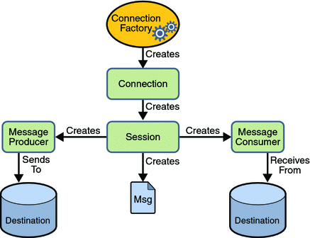

# Message Queue
**MQ特点**
- 先进先出
不消息队列的顺序在入队的时候就基本已经确定了，一般是不需人工干预的。而且，最重要的是，数据是只有一条数据在使用中。 这也是MQ在诸多场景被使用的原因。

- 发布订阅
发布订阅是一种很高效的处理方式，如果不发生阻塞，基本可以当做是同步操作。这种处理方式能非常有效的提升服务器利用率，这样的应用场景非常广泛。

- 持久化
持久化确保MQ的使用不只是一个部分场景的辅助工具，而是让MQ能像数据库一样存储核心的数据。

- 分布式
在现在大流量、大数据的使用场景下，只支持单体应用的服务器软件基本是无法使用的，支持分布式的部署，才能被广泛使用。而且，MQ的定位就是一个高性能的中间件。

**注意事项**

其实，还有非常多的业务场景，是可以考虑用MQ方式的，但是很多时候，也会存在**滥用**的情况，我们需要清楚认识我们的业务场景：

发验证码短信、邮件，这种过分依赖外部，而且时效性可以接收几十秒延迟的，其实更好的方式是**多线程异步**处理，而不是过多依赖MQ。

秒杀抢购确保库存不为负数，更多的依赖高性能缓存（如redis），以及强制加锁，千万不要依赖消费者最终的返回结果。（实际工作中已经看到好几个这样的案例了）**上游-下游**这种直接的处理方式效率肯定是比 **上游-MQ-下游** 方式要高，**MQ效率高，是因为，我只是上游-MQ 这个阶段就当做已经成功了**。

现在**常用的MQ组件**有activeMQ、rabbitMQ、rocketMQ、zeroMQ,当然近年来火热的kafka

# JMS(Java Message Service)

> like JDBC, a java standard Message Service interface.

## Message Objects

JMS 定义了五种不同的消息正文格式，以及调用的消息类型，允许你发送并接收以一
些不同形式的数据，提供现有消息格式的一些级别的兼容性。

- TextMessage--一个字符串对象
- MapMessage--一套名称-值对
- ObjectMessage--一个序列化的 Java 对象
- BytesMessage--一个字节的数据流
- StreamMessage -- Java 原始值的数据流

## Messaging Domains

**Point-to-Point (PTP) Messaging Domain**

> 在点对点通信模式中，应用程序由消息队列，发送方，接收方组成。每个消息都被发送到一个特定的队列，接收者从队列中获取消息。队列保留着消息，直到他们被消费或超时。

- 每个消息只要一个消费者
- 发送者和接收者在时间上是没有时间的约束，也就是说发送者在发送完消息之后，不管接收者有没有接受消息，都不会影响发送方发送消息到消息队列中。
- 发送方不管是否在发送消息，接收方都可以从消息队列中去到消息（The receiver can fetch message whether it is running or not when the sender sends the message）
- 接收方在接收完消息之后，需要向消息队列应答成功

**Publisher/Subscriber (Pub/Sub) Messaging Domain**

> 在发布/订阅消息模型中，发布者发布一个消息，该消息通过topic传递给所有的客户端。该模式下，发布者与订阅者都是匿名的，即发布者与订阅者都不知道对方是谁。并且可以动态的发布与订阅Topic。Topic主要用于保存和传递消息，且会一直保存消息直到消息被传递给客户端。

**特点**：

- 一个消息可以传递个多个订阅者（即：一个消息可以有多个接受方）
- 发布者与订阅者具有时间约束，针对某个主题（Topic）的订阅者，它必须创建一个订阅者之后，才能消费发布者的消息，而且为了消费消息，订阅者必须保持运行的状态。
- 为了缓和这样严格的时间相关性，JMS允许订阅者创建一个可持久化的订阅。这样，即使订阅者没有被激活（运行），它也能接收到发布者的消息。

## JMS接收消息
在JMS中，消息的产生和消息是异步的。对于消费来说，JMS的消息者可以通过两种方式来消费消息。

1. 同步（Synchronous）
在同步消费信息模式模式中，订阅者/接收方通过调用 receive（）方法来接收消息。在receive（）方法中，线程会阻塞直到消息到达或者到指定时间后消息仍未到达。

2. 异步（Asynchronous）
使用异步方式接收消息的话，消息订阅者需注册一个**消息监听者**，类似于事件监听器，只要消息到达，JMS服务提供者会通过调用监听器的onMessage()递送消息。

## JMS编程模型　

- 管理对象（Administered objects）-连接工厂（Connection Factories）和目的地（Destination）
- 连接对象（Connections）
- 会话（Sessions）
- 消息生产者（Message Producers）
- 消息消费者（Message Consumers）
- 消息监听者（Message Listeners）

---
## 常见的应用场景

<https://www.cnblogs.com/joylee/p/8916460.html>

**应用解耦（异步）**

系统之间进行数据交互的时候，在时效性和稳定性之间我们都需要进行选择。基于线程的异步处理，能确保用户体验，但是极端情况下可能会出现异常，影响系统的稳定性，而同步调用很多时候无法保证理想的性能，那么我们就可以用MQ来进行处理。上游系统将数据投递到MQ，下游系统取MQ的数据进行消费，投递和消费可以用同步的方式处理，因为MQ接收数据的性能是非常高的，不会影响上游系统的性能，那么下游系统的及时率能保证吗？当然可以，不然就不会有下面的一个应用场景。

**通知**

这里就用到了前文一个重要的特点，发布订阅，下游系统一直在监听MQ的数据，如果MQ有数据，下游系统则会按照 先进先出 这样的规则， 逐条进行消费 ，而上游系统只需要将数据存入MQ里，这样就既降低了不同系统之间的耦合度，同时也确保了消息通知的及时性，而且也不影响上游系统的性能。

**限流**

上文有说了一个非常重要的特性，MQ 数据是只有一条数据在使用中。 在很多存在并发，而又对数据一致性要求高，而且对性能要求也高的场景，如何保证，那么MQ就能起这个作用了。不管多少流量进来，MQ都会让你遵守规则，排除处理，不会因为其他原因，导致并发的问题，而出现很多意想不到脏数据。

**数据分发**

MQ的发布订阅肯定不是只是简单的一对一，一个上游和一个下游的关系，MQ中间件基本都是支持一对多或者广播的模式，而且都可以根据规则选择分发的对象。这样上游的一份数据，众多下游系统中，可以根据规则选择是否接收这些数据，这样扩展性就很强了。

**分布式事务**

分布式事务是我们开发中一直尽量避免的一个技术点，但是，现在越来越多的系统是基于微服务架构开发，那么分布式事务成为必须要面对的难题，解决分布式事务有一个比较容易理解的方案，就是二次提交。基于MQ的特点，MQ作为二次提交的中间节点，负责存储请求数据，在失败的情况可以进行多次尝试，或者基于MQ中的队列数据进行回滚操作，是一个既能保证性能，又能保证业务一致性的方案，当然，这个方案的主要问题就是定制化较多，有一定的开发工作量。

# ActiveMQ

